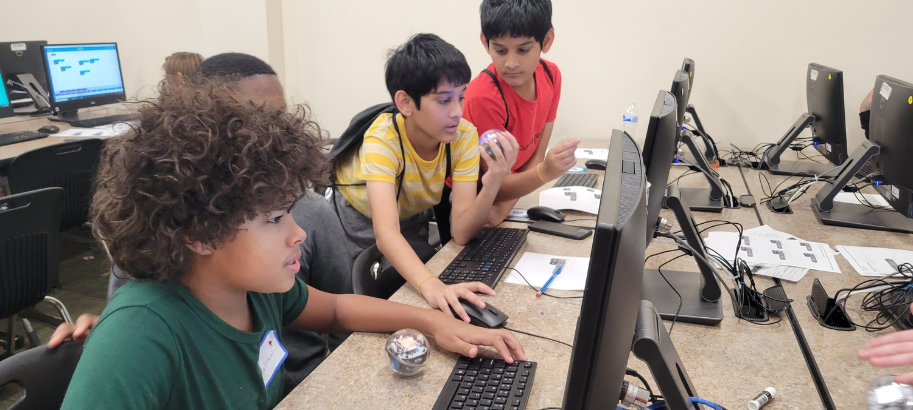

by [Ammar Mehicevic,Etienne Laccruche,Tony Lam](https://www.youtube.com/embed/W7AJaQqIAE0?si=D3_BeB6ZyTDeGda7)

## Description:
The primary goal of this project is educating others about algorithms by programming a robot through a maze using SpheroEDU. Sphero is a small robot ball that moves around by either remote control or code you feed it. This workshop is geared towards educating and creating interest in the IT field for non STEM majors. By engaging in our workshops, students will get to experiment with Sphero.edu and block coding, which allows them to learn about algorithms through relatable examples. The Technology Ambassador Program (TAP) at GGC strives to break the misconceptions of the IT field by providing fun workshops for students of all backgrounds. TAP students design engaging and fun outreach workshops to encourage interest in IT and STEM.

[sphero,  Algorithm, Code, 6th grade, 7th Grade, 8th grade, 9th grade, 10th grade, 11th grade, 12th grade, college](Tags:)

# Materials:
[Spheros](https://sphero.com/collections/all/products/sphero-bolt-power-pack), [Sphero EDU app](https://edu.sphero.com/sphero/home),Sphero EDU website teacher account, a 36 in. x 48 in. foldable foam board, and a 36 in. x 48 in. plywood

## \Short Demo:

<iframe width="560" height="100%" src="https://www.youtube.com/embed/W7AJaQqIAE0?si=D3_BeB6ZyTDeGda7" title="YouTube video player" frameborder="0" allow="accelerometer; autoplay; clipboard-write; encrypted-media; gyroscope; picture-in-picture; web-share" referrerpolicy="strict-origin-when-cross-origin" allowfullscreen style="width: 560px; height: 315px;"></iframe>

## Steps:
1. Create a SpheroEDU teacher account.
2. Click on my content.
3. Click on “Create a Program”.
4. Create your easy code that completes the easy part of the maze.
5. Create your hard code that completes the hard part of the maze.
6. Allocate the program into the shared resources so students will have access to it.
7. Go to your classes tab.
8. Go to shared resources.
9. Click add programs.
10. Select both codes.
11. Click submit.

[Creating A Sphero Teacher Account](https://github.com/TAP-GGC/Jedi/blob/main/Media/Creating%20a%20Teacher%20Sphero%20Account.pdf).

See more in the [Source Code](https://github.com/TAP-GGC/Jedi).
